# School Management System CRM

A modern, full-featured **Institute Management System** for educational institutes. Manage student admissions, courses, batches, attendance, fees, exams, certificates, faculty, reports, and notifications — all from a single, role-aware dashboard.

Built for **TechAcademy** as a production-grade institute CRM with a polished React dashboard. The **front-end runs standalone** today (Zustand + localStorage demo mode). A **Node.js + MySQL API** lives in [`backend/`](backend/README.md) and is ready for integration — see [Data & persistence](#data--persistence).

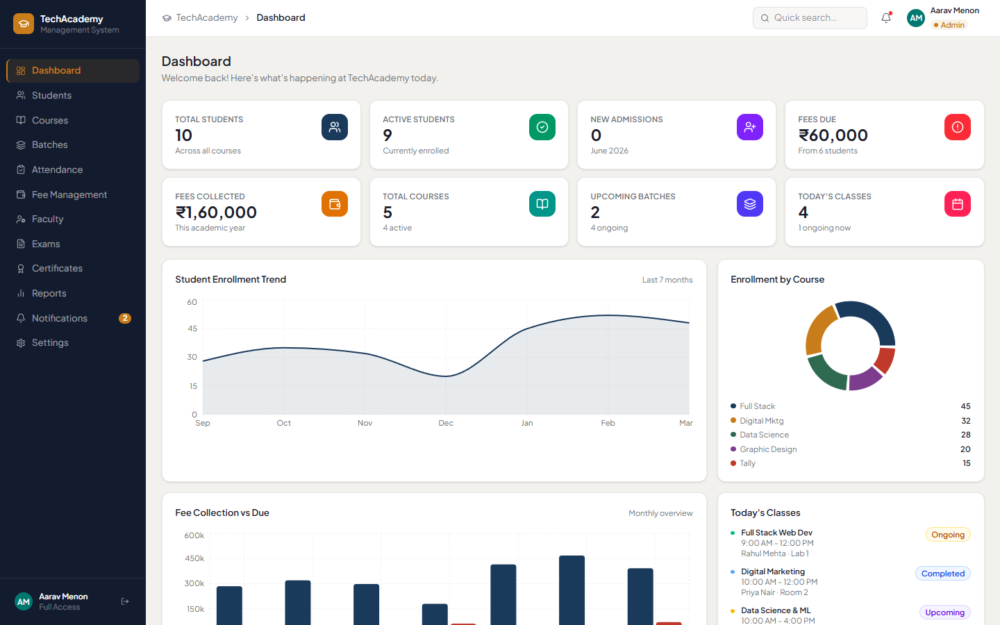

---

## Table of Contents

- [Overview](#overview)
- [Screenshots](#screenshots)
- [Features](#features)
- [User Roles & Access](#user-roles--access)
- [Tech Stack](#tech-stack)
- [Project Structure](#project-structure)
- [Getting Started](#getting-started)
- [Demo Accounts](#demo-accounts)
- [Available Scripts](#available-scripts)
- [Data & Persistence](#data--persistence)
- [CI / Quality Checks](#ci--quality-checks)
- [Architecture Notes](#architecture-notes)
- [Regenerating Screenshots](#regenerating-screenshots)
- [Specification Reference](#specification-reference)
- [Roadmap & Limitations](#roadmap--limitations)

---

## Overview

This CRM covers end-to-end institute administration:

| Area | Capabilities |
|------|-------------|
| **Students** | Admissions, profiles, ID generation, guardian info, course/batch enrollment, search & export |
| **Courses** | Create courses, duration, fees, descriptions, active/inactive status |
| **Batches** | Batch creation, timings, faculty assignment, student lists, status tracking |
| **Attendance** | Daily student attendance, monthly reports, absent student lists |
| **Fees** | Collection, due tracking, installments, payment history, printable receipts |
| **Faculty** | Profiles, subject assignment, salary records, faculty attendance |
| **Exams** | Exam creation, marks entry, results, performance reports |
| **Certificates** | Issue certificates, certificate numbers, print-ready layouts |
| **Reports** | Student, admission, fee, attendance, and faculty reports |
| **Notifications** | Fee reminders, admission confirmations, course completion alerts |
| **Settings** | Institute branding, receipt format, certificate format, role overview |

> **Note:** With `VITE_API_ENABLED=true` (see `.env.local`), the React app uses the **MySQL backend** for auth and data. Run **`npm run dev:all`** to start front-end and API together. Demo mode (offline) remains available when API is disabled.

---

## Screenshots

### Login

Role-based sign-in with demo account shortcuts for Admin, Staff, and Faculty.

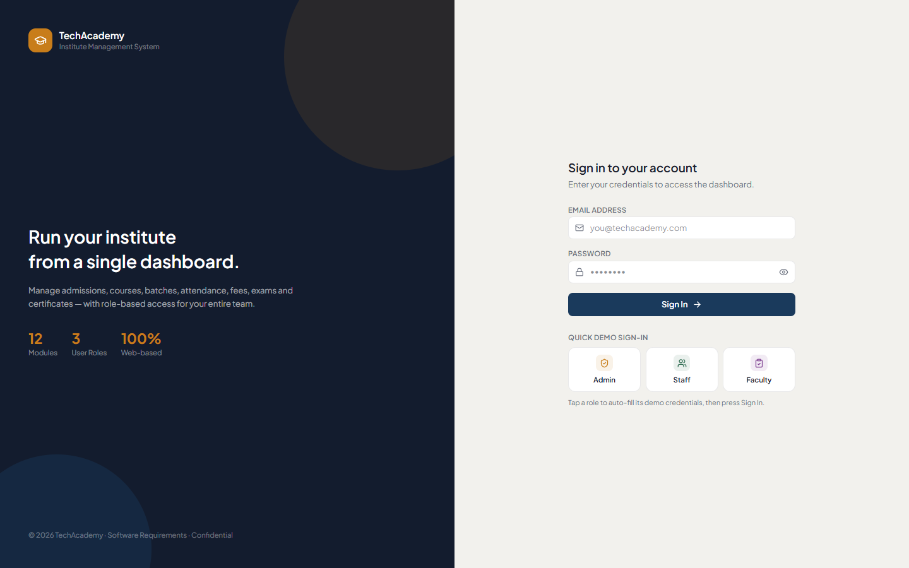

### Dashboard

Real-time KPIs, enrollment trends, fee collection charts, course distribution, and today's class schedule.


### Students

Search, filter, paginate, add/edit students, view detailed profiles, and export data.

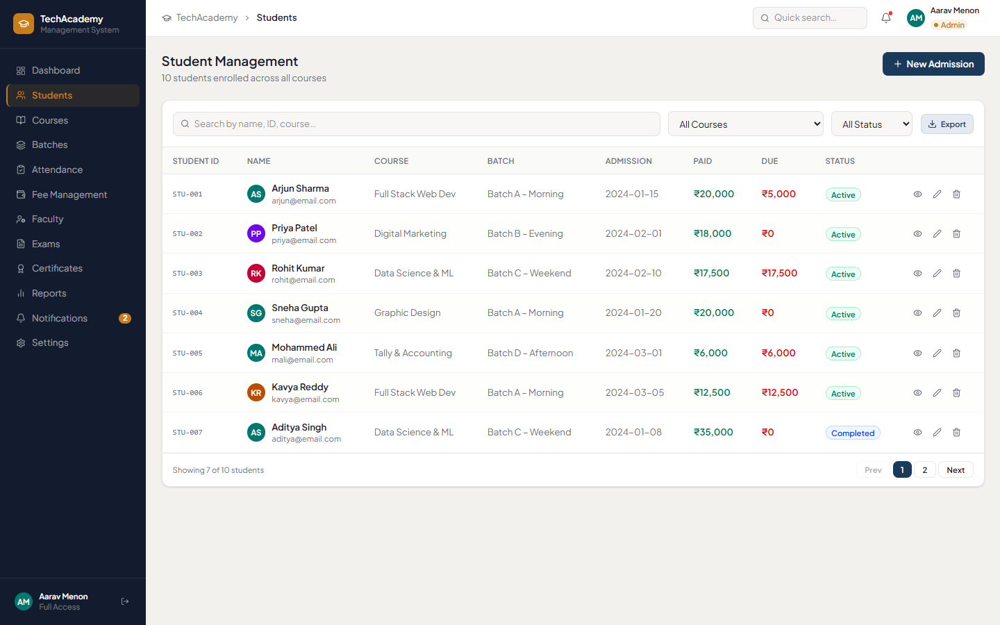

### Courses

Manage course catalog with duration, fees, enrollment counts, and status.

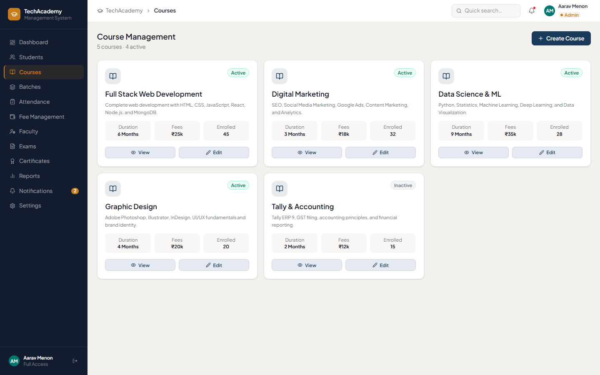

### Batches

Organize students into timed batches with faculty assignment and status tracking.

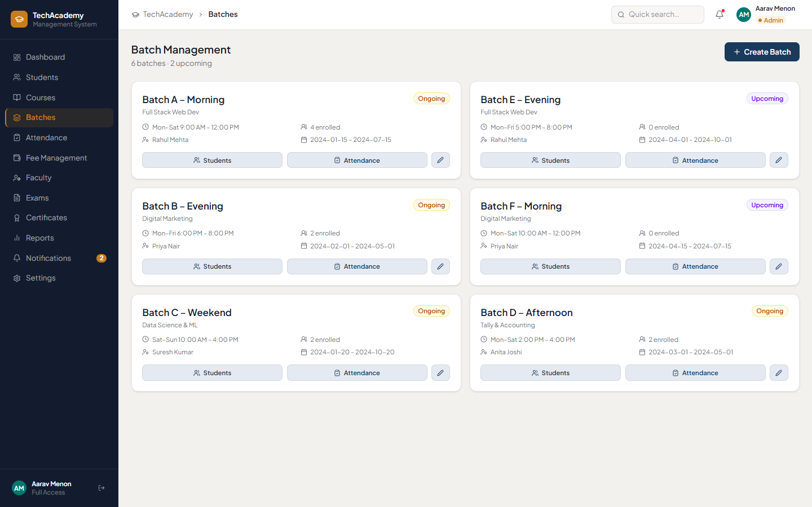

### Attendance

Mark daily attendance and review monthly attendance summaries.

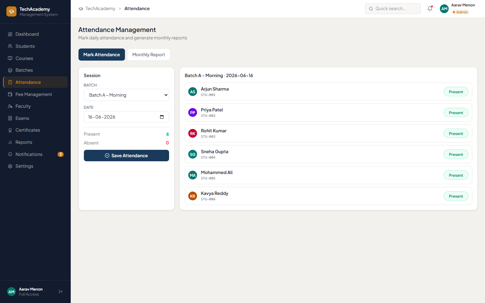

### Fee Management

Collect fees, track dues, view payment history, send reminders, and print receipts.

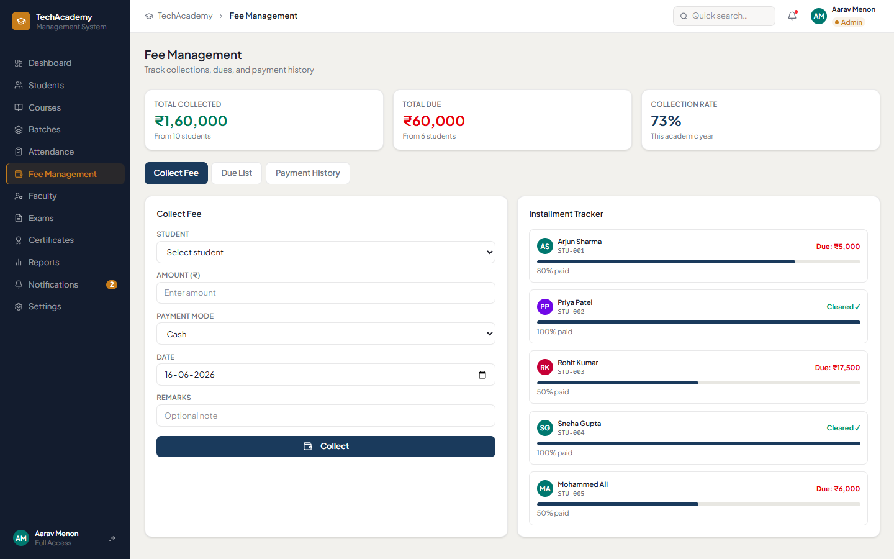

### Faculty

Manage trainer profiles, subjects, salary slips, and attendance.

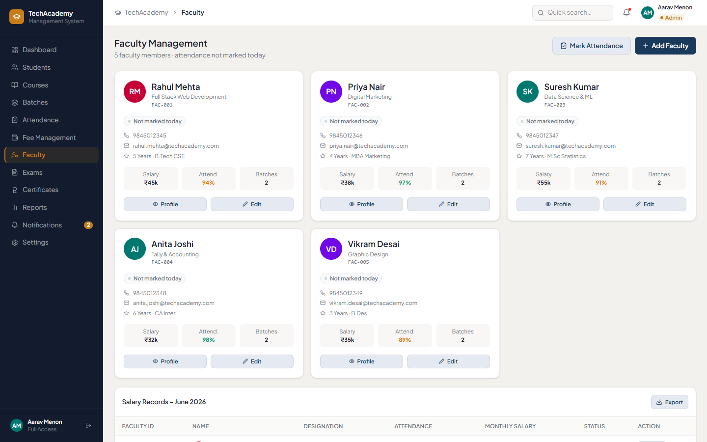

### Exams

Create exams, enter marks, and review student performance.

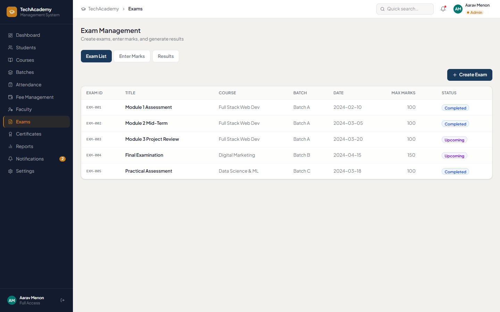

### Certificates

Issue and print completion certificates with unique certificate numbers.

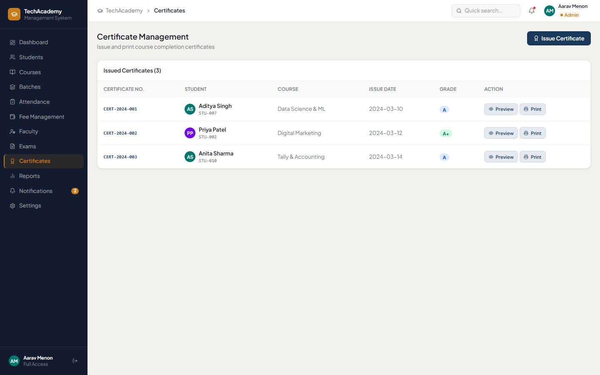

### Reports

Generate institute-wide reports across students, fees, attendance, and faculty.

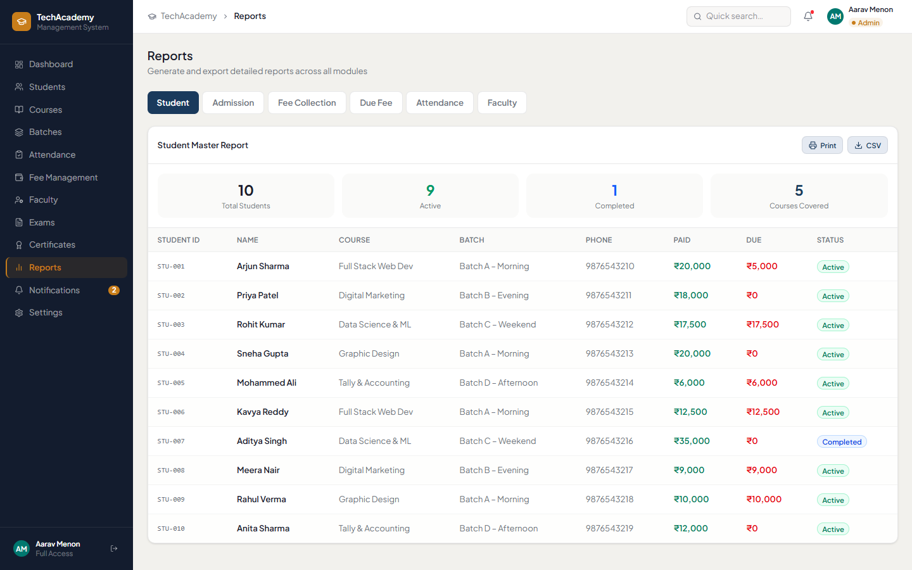

### Notifications

Centralized notification inbox with read/unread status.

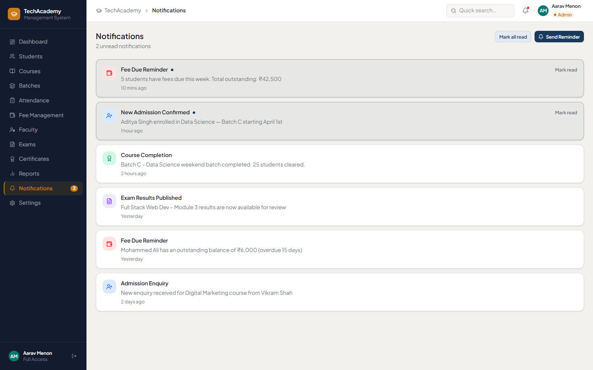

### Settings

Configure institute details, logo, receipt format, certificate layout, and role permissions.

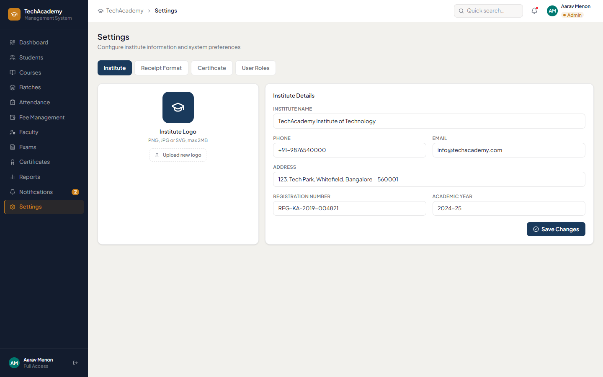

---

## Features

### Dashboard
- Total & active student counts
- New admissions this month
- Fees due & fees collected
- Total courses & upcoming batches
- Today's class schedule
- Enrollment trend chart (area)
- Fee collection chart (bar)
- Course distribution (pie)

### Student Management
- New student admission with auto-generated IDs
- Student photo upload
- Guardian information & address
- Course enrollment & batch assignment
- Full student profile view
- Search by name, ID, or course
- Filter by course and status
- CSV export
- Pagination

### Course Management
- Create / edit / delete courses
- Duration, fees, and description
- Active / inactive status
- Batch and enrollment counts
- Course detail modal

### Batch Management
- Create batches with timing and dates
- Faculty assignment
- View enrolled students per batch
- Status: Upcoming, Ongoing, Completed

### Attendance Management
- Daily attendance marking (Present / Absent / Leave)
- Batch-wise attendance
- Monthly attendance summary
- Absent student list

### Fee Management
- Fee collection with multiple payment modes
- Due fees tracking & installment support
- Payment history with receipts
- Printable fee receipts
- Due student list & reminder actions
- Collection rate statistics

### Faculty / Trainer Management
- Add and manage faculty profiles
- Subject assignment & qualifications
- Salary records with printable salary slips
- Faculty attendance tracking

### Exam Management
- Create exams by course and batch
- Marks entry and result generation
- Student performance overview

### Certificate Management
- Issue certificates to eligible students
- Auto certificate number generation
- Print-ready certificate preview

### Reports
- Student report
- Admission report
- Fee collection report
- Due fee report
- Attendance report
- Faculty report

### Notifications
- Fee due reminders
- Admission confirmations
- Course completion notifications
- Mark as read / delete

### Settings
- Institute name, address, contact details
- Logo upload (max 2 MB)
- Receipt format configuration
- Certificate format configuration
- User role reference panel

---

## User Roles & Access

| Role | Access Level | Modules |
|------|-------------|---------|
| **Admin** | Full access — all modules and settings | All modules |
| **Staff** | Student & fee management | Dashboard, Students, Courses, Batches, Attendance, Fees, Notifications |
| **Faculty** | Attendance & marks entry | Dashboard, Attendance, Exams, Notifications |

Navigation is filtered automatically based on the signed-in user's role. Unauthorized routes redirect to the dashboard.

**Backend alignment:** The API uses the same three roles (`admin`, `staff`, `faculty`). API route guards are stricter in places — e.g. faculty management and certificate issuance are **admin-only** on the server, while staff can list students/courses/batches and manage fees. When the front-end is wired to the API, nav and server permissions will need to stay in sync. See [`backend/README.md`](backend/README.md#rbac--role--permission-matrix).

---

## Tech Stack

| Layer | Technology |
|-------|-----------|
| **Framework** | React 18 |
| **Language** | TypeScript (strict mode) |
| **Build Tool** | Vite 6 |
| **Routing** | React Router 7 |
| **State** | Zustand 5 (with `persist` middleware → localStorage) |
| **Styling** | Tailwind CSS 4 |
| **UI Components** | Radix UI primitives + custom shared components |
| **Charts** | Recharts |
| **Icons** | Lucide React |
| **Forms** | React Hook Form |
| **Animations** | Motion |
| **Toasts** | Sonner |
| **Dates** | date-fns |
| **Package Manager** | npm (workspaces: front-end + `backend/`) |

---

## Project Structure

```
school-management-crm/
├── .github/workflows/     # CI pipeline (lint, typecheck, build)
├── backend/               # Node.js + Express + MySQL API (see backend/README.md)
├── docs/
│   ├── API.md             # REST contract (shared with backend)
│   ├── DATABASE.md        # SQL schema reference
│   └── screenshots/       # README screenshots (auto-generated)
├── guidelines/            # Product specification (PDF)
├── public/                # Static assets
├── scripts/
│   └── capture-screenshots.mjs
├── src/
│   ├── api/               # HTTP client scaffold (VITE_API_ENABLED=false by default)
│   ├── app/               # App shell and router
│   ├── components/
│   │   ├── layout/        # AppShell, Sidebar, Header, ErrorBoundary
│   │   └── shared/        # Reusable UI (Btn, Card, Modal, StatCard, …)
│   ├── constants/         # Demo data, navigation, roles
│   ├── features/          # Feature modules (one folder per page)
│   │   ├── auth/
│   │   ├── dashboard/
│   │   ├── students/
│   │   ├── courses/
│   │   ├── batches/
│   │   ├── attendance/
│   │   ├── fees/
│   │   ├── faculty/
│   │   ├── exams/
│   │   ├── certificates/
│   │   ├── reports/
│   │   ├── notifications/
│   │   └── settings/
│   ├── lib/               # Utilities (formatting, export helpers)
│   ├── store/             # Zustand global store
│   ├── styles/            # Global CSS, theme tokens, fonts
│   └── types/             # Shared TypeScript types
├── index.html
├── package.json
├── package.json           # npm workspaces: "backend"
├── tsconfig.json
├── vite.config.ts         # Dev proxy: /api → localhost:5000
└── README.md
```

Path alias: `@/` → `src/` (configured in both `vite.config.ts` and `tsconfig.json`).

---

## Getting Started

### Prerequisites

- **Node.js** 20 or later
- **Node.js** 20 or later
- **npm** 10+ (included with Node.js)

### Installation

```bash
# Clone the repository
git clone <repository-url>
cd school-management-crm

# Install dependencies
npm install
```

### Development

```bash
npm run dev
```

Open [http://localhost:3000](http://localhost:3000) in your browser. Vite will pick the next available port if 3000 is in use.

### Backend API (optional)

The Express API runs separately on port **5000**. It is **not required** for the demo UI.

```bash
# From repo root — starts backend with tsx watch
npm run dev:api
```

Set up MySQL and `backend/.env` first — see [backend/README.md](backend/README.md). Vite proxies `/api` to `http://localhost:5000` during front-end dev.

To switch the React app to the API later, set `VITE_API_ENABLED=true` and `VITE_API_URL` in `.env.local` (see [`src/api/README.md`](src/api/README.md)).

### Production Build

```bash
npm run build
```

Output is written to the `dist/` folder.

### Preview Production Build

```bash
npm run preview
```

---

## Demo Accounts

Use these credentials on the login page, or click the demo role buttons to auto-fill:

| Role | Email | Password |
|------|-------|----------|
| Admin | `admin@techacademy.com` | `admin123` |
| Staff | `staff@techacademy.com` | `staff123` |
| Faculty | `faculty@techacademy.com` | `faculty123` |

Authentication is **client-side only** for demonstration purposes. Do not use these patterns in production.

---

## Available Scripts

| Command | Description |
|---------|-------------|
| `npm run dev` | Start Vite dev server with HMR (front-end) |
| `npm run dev:api` | Start Express backend on port 5000 |
| `npm run dev:all` | Start front-end + backend together |
| `npm run build` | Type-check and build for production |
| `npm run preview` | Serve the production build locally |
| `npm run lint` | Run ESLint across the project |
| `npm run lint:fix` | Auto-fix ESLint issues |
| `npm run format` | Format all files with Prettier |
| `npm run format:check` | Check formatting without writing |
| `npm run screenshots` | Regenerate README screenshots (requires dev server) |

---

## Data & Persistence

### API mode (recommended)

```bash
# Terminal 1 + 2 in one command:
npm run dev:all
```

1. Ensure MySQL is running and `backend/.env` is configured (`npm run db:setup --workspace=school-management-crm-backend` once).
2. Copy `.env.example` → `.env.local` (API enabled by default).
3. Sign in with your **backend admin** account (`ADMIN_EMAIL` / `ADMIN_PASSWORD` in `backend/.env`).

| Mode | Data source | Auth |
|------|-------------|------|
| API (default in `.env.example`) | MySQL via `backend/` | JWT + HttpOnly refresh cookie |
| Demo (`VITE_API_ENABLED=false`) | Zustand + localStorage | Client-side demo passwords |

---

## CI / Quality Checks

GitHub Actions runs on every push and pull request to `main` / `master`:

1. `npm ci`
2. `npm run typecheck` — TypeScript strict compilation
3. `npm run lint` — ESLint
4. `npm run build` — Production build verification

Workflow file: [`.github/workflows/ci.yml`](.github/workflows/ci.yml)

---

## Architecture Notes

- **Feature-based folders** — each module owns its page and modals under `src/features/`.
- **Lazy-loaded routes** — pages are code-split via `React.lazy()` for faster initial load.
- **Protected routes** — unauthenticated users are redirected to `/login`.
- **Error boundaries** — each route is wrapped in an `ErrorBoundary` to prevent full-app crashes.
- **Role-based navigation** — sidebar items filtered via `canAccess()` in `src/constants/roles.ts`.
- **Shared design system** — custom components in `src/components/shared/`.

---

## Regenerating Screenshots

Screenshots in `docs/screenshots/` can be refreshed after UI changes:

```bash
# Terminal 1 — start the dev server
npm run dev

# Terminal 2 — capture screenshots (uses Chrome on Windows by default)
npm run screenshots
```

Optional environment variables:

| Variable | Default | Purpose |
|----------|---------|---------|
| `APP_URL` | `http://localhost:3000` | Dev server URL |
| `CHROME_PATH` | `C:\Program Files\Google\Chrome\Application\chrome.exe` | Chrome executable |

---

## Specification Reference

The full product specification is available in:

- [`guidelines/Institute_Management.pdf`](guidelines/Institute_Management.pdf) — Feature specification document v1.0

---

## Roadmap & Limitations

### Current limitations
- Production deployment (Docker, HTTPS, CI migrations) not configured yet — see Part C7 in `ROADMAP.md`
- Email/SMS delivery for fee reminders is queued locally; backend SMTP is optional
- Demo login shortcuts remain for offline mode (`VITE_API_ENABLED=false`)
- React Query cache layer not added yet (optional B.10)

### Planned enhancements
- Remove `DEMO_USERS` from production builds
- Email/SMS notification delivery
- Multi-institute (tenant) support
- Mobile-responsive enhancements & PWA

See [`ROADMAP.md`](ROADMAP.md) for the full task list.

---

## License

This project is **private** (`"private": true` in `package.json`). All rights reserved unless otherwise specified by the repository owner.
